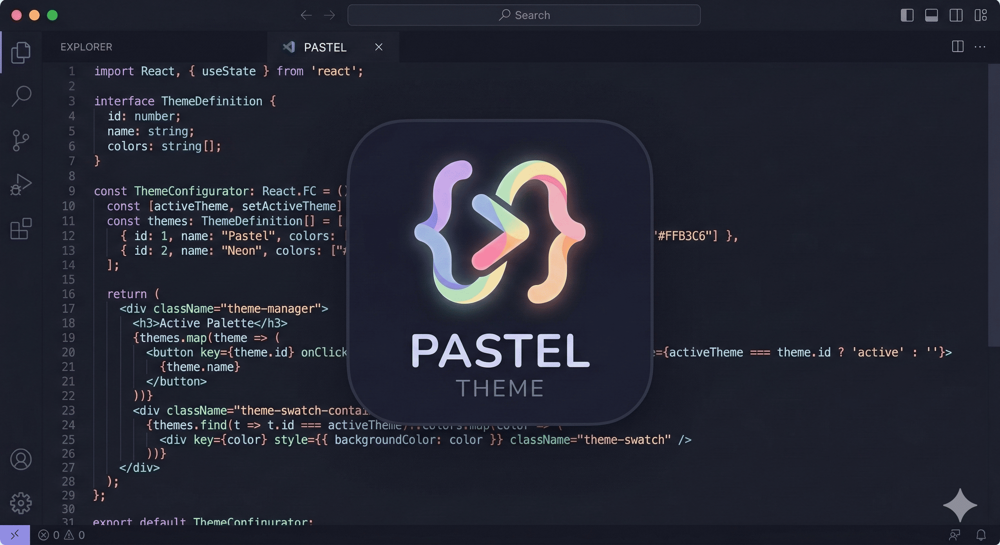

# Pastel Theme ✨

*A modern dark theme with vibrant pastel accents, designed to reduce eye strain while keeping your code visually beautiful.*

---

## 🎨 About the Theme

**Pastel** was created from the need for a deep and comfortable dark workspace—perfect for long coding sessions—without sacrificing readability.  
It uses a carefully selected pastel color palette to highlight the syntax of your favorite programming languages while keeping the interface soft and easy on the eyes.

### ✨ Features

- **Optimal Contrast:** Deep navy background with soft and clear text for comfortable reading.
- **Semantic Colors:** Distinct pastel tones for functions, variables, classes, and strings to improve quick recognition.
- **Multi-Language Support:** Optimized for HTML, CSS, JavaScript, TypeScript, Python, JSON, and Markdown.
- **Minimalist UI:** Subtle colors for the sidebar, terminal, and status bar so your focus stays on the code.

---

### From the Antigravity Marketplace

1. Open the **Extensions** view in Antigravity (`Ctrl + Shift + X` or `Cmd + Shift + X` on Mac).
2. Search for **Pastel - Theme**.
3. Click **Install**.
4. Go to **Preferences → Color Theme** (`Ctrl + K` then `Ctrl + T`).
5. Select **Pastel - Theme**.

---

Made with 💜 by **BR2E**